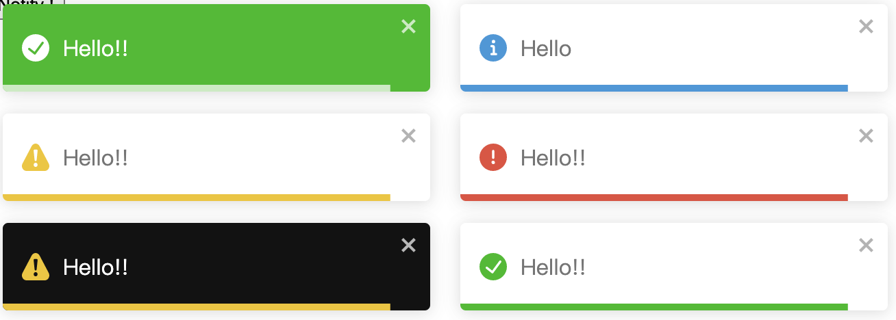

# Icons

## Built-in icons



Notifications of different types (`toast.info`, `toast.error`, `toast.success`, `toast.warning`) display an icon associated with the selected type.


::: sandbox
```vue /src/App.vue
<script setup lang="ts">
import { toast } from 'vue3-toastify';
import 'vue3-toastify/dist/index.css';

const notify = () => {
  toast.info('Hello!!'); // same as toast('Hello!!', { type: 'info' });
  toast.error('Hello!!');
  toast.success('Hello!!');
  toast.success('Hello!!', {
    theme: 'colored',
    position: toast.POSITION.TOP_LEFT,
  });
  toast.warn('Hello!!', {
    position: toast.POSITION.TOP_LEFT,
  });
  toast.warn('Hello!!', {
    theme: 'dark',
    position: toast.POSITION.TOP_LEFT,
  });
};
</script>

<template>
  <div>
    <button @click="notify">Notify !</button>
  </div>
</template>
```
:::

## Disable icons

- Disable the icon individually

::: sandbox
```vue /src/App.vue
<script setup lang="ts">
import { toast } from 'vue3-toastify';
import 'vue3-toastify/dist/index.css';

const notify = () => {
  toast.error('Without icon', {
    icon: false,
  });
};
</script>

<template>
  <div>
    <button @click="notify">Notify !</button>
  </div>
</template>
```
:::

- Disable the icon gloabally


::: sandbox
```vue /src/App.vue
<template>
  <div>
    <button @click="notify">Notify !</button>
  </div>
</template>

<script setup lang="ts">
import { toast } from 'vue3-toastify';

const notify = () => toast.error('Disable the icon gloabally !');
</script>
```

```js /src/main.ts [active]
import App from './App.vue';
import { createApp } from 'vue';
import Vue3Toasity from 'vue3-toastify';
import 'vue3-toastify/dist/index.css';

createApp(App).use(
  Vue3Toasity,
  {
    icon: false,
  }, // global options type definition --> ToastContainerOptions
).mount('#app');
```
:::

## Custom icons

::: sandbox
```vue /src/App.vue
<script setup lang="ts">
import { h } from 'vue';
import { toast } from 'vue3-toastify';
import { VNodeIcon, ComponentIcon } from './icons.tsx';
import 'vue3-toastify/dist/index.css';

const notify = () => {
  toast.success('You can provide any string', {
    icon: "🚀",
  });

  toast.success('You can provide any number', {
    icon: 1,
  });

  toast.success('You can provide any VNode', {
    icon: VNodeIcon,
    position: toast.POSITION.TOP_LEFT,
  });

  toast.success('You can provide a Component', {
    icon: ComponentIcon,
    position: toast.POSITION.TOP_LEFT,
  });

  // or
  toast('You can provide callback and return a component', {
    icon: ({ theme, type }) => h(ComponentIcon, { theme, type }),
    position: toast.POSITION.TOP_LEFT,
  });
};
</script>

<template>
  <div>
    <button @click="notify">Notify !</button>
  </div>
</template>
```

<<< @/snippets/icons.tsx{prefix=/src/}
:::

## Custom icons globally

::: sandbox
```js /src/main.ts [active]
import App from './App.vue';
import { createApp } from 'vue';
import { VNodeIcon } from './icons.tsx';
import Vue3Toasity from 'vue3-toastify';
import 'vue3-toastify/dist/index.css';

createApp(App).use(
  Vue3Toasity,
  {
    icon: VNodeIcon,
  },
).mount('#app');
```

```vue /src/App.vue
<script setup lang="ts">
import { h } from 'vue';
import { toast } from 'vue3-toastify';

const notify = () => {
  toast.success('You can provide any VNode');
};
</script>

<template>
  <div>
    <button @click="notify">Notify !</button>
  </div>
</template>
```

<<< @/snippets/icons.tsx{prefix=/src/}
:::

:::tip
Code in Jsx:

```jsx
toast('HELLO', {
  icon: ({ theme, type }) => (
    <ComponentIcon
      theme={theme}
      type={type}
      class={theme}
      style={{ fontSize: '12px' }}
    />
  ),
});
```
:::
